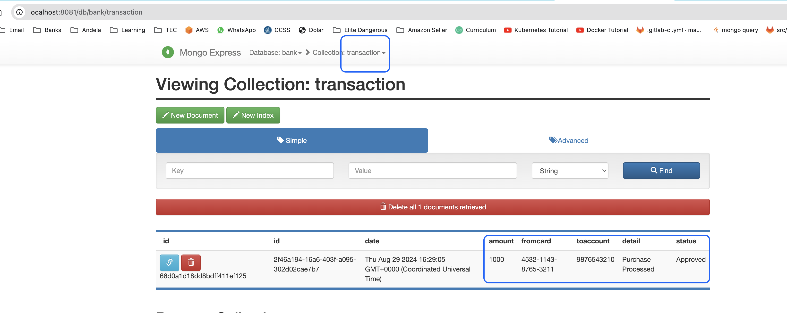

# ONLINE PAYMENT PLATFORM
===============

## Introduction
------------

With the rapid expansion of e-commerce, there is a pressing need for an efficient payment gateway. This project aims to develop an online payment platform, which will be an API-based application enabling e-commerce businesses to securely and seamlessly process transactions. This application was created as part of a tech test for a real company interview.

### Features
------------

* Customer: Individuals who make online purchases and complete payments through the platform.
* Merchant: The seller who utilizes the payment platform to receive payments from customers.
* Online Payment Platform: An application that validates requests, stores card information, and manages payment requests and responses to and from the acquiring bank.
* Acquiring Bank: Facilitates the actual retrieval of funds from the customer's card and transfers them to the merchant. Additionally, it validates card information and sends payment details to the relevant processing organization.

## Getting Started
---------------

<!-- ### Prerequisites
------------

* List of prerequisites to run the project
* List of dependencies required -->

* This project is intended to be run locally by using docker-compose, since it was meant to be a tech test. No further features like CI/CD, deployments or any AWS-related features were added. 

### Running the Project
-------------------

This repo is a worspace and it has X different projects. Please review the following list of projects and the appropriate steps to follow to run the application:

* Bank: This is the Acquiring Bank, responsible of checking accounts and validate credit cards. 

## BANK
-----------------
This is the Acquiring Bank, responsible of checking accounts and validate credit cards.

### Endpoints
------------

* `/transfer` - transfer endpoint executes the purchase. This features checks the buyers credit card information, checks the seller's account existance and lastly verifies the buyer's balance is enough before executing the transation. If the transaction is done, the amount will be debited from the credit card and added to the seller's account.

Request Header Values:
    - card_number: Buyers credit card number.
    - holder_name: Buyers credit card holder name.
    - exp_date: Credit card expiration date.
    - cvv: Credit card security code.
    - target_account_number: Seller's account number.
    - amount: Transaction Amount.

    Example:
    curl --location 'http://localhost:8080/transfer' \
    --header 'card_number: 4532-1143-8765-3211' \
    --header 'holder_name: Emily Chen' \
    --header 'exp_date: 02/2027' \
    --header 'cvv: 987' \
    --header 'target_account_number: 9876543210' \
    --header 'amount: 1'

* `/fillup` - fillup endpoint adds random data to the mongodb database, this is only used for testing purposes. No parameters needed.

    Example:
    curl http://localhost:8080/fillup

* `/history` - history endpoint retrieves all payment history done to a specific account number.

    Example:
    curl --location 'http://localhost:8080/history' \
    --header 'account_number: 9876543210'

Request Header Values:
    - account_number: Account number to be retrieved.

### Models
---------
Account struct {
	ID            string  `json:"id"`
	AccountNumber string  `json:"account_number"`
	Amount        float64 `json:"amount"`
}

Customer struct {
	ID        string `json:"id"`
	FirstName string `json:"first_name"`
	LastName  string `json:"last_name"`
	Email     string `json:"email"`
}

Card struct {
	ID         string    `json:"id"`
	CardNumber string    `json:"card_number"`
	HolderName string    `json:"holder_name"`
	ExpDate    string    `json:"exp_date"`
	CVV        string    `json:"cvv"`
	Account    *Account  `json:"account"`
	Customer   *Customer `json:"customer"`
}

type Transaction struct {
	ID          string    `json:"id"`
	Date        time.Time `json:"date"`
	Amount      float64   `json:"amount"`
	FromAccount string    `json:"from_account"`
	ToAccount   string    `json:"toaccount"`
	Detail      string    `json:"detail"`
}

## AUTH
-----------------
This service creates and verifies tokens for user authentication.

### Endpoints
------------

* `/auth/token` - This endpoint is used for two different purposes:
    - Token Creation (POST)
        Request Header Values:
            - X-User-Name: user name.
            - X-Entity-Key: Entity Key provided by the bank.

            Example:
            curl --location --request POST 'http://localhost:8181/auth/token' \
            --header 'X-User-Name: pvillalobos' \
            --header 'X-Entity-Name: Bank' \
            --header 'X-Entity-Key: [key]'

            curl --location --request POST 'http://localhost:8181/auth/token' \
            --header 'X-User-Name: pvillalobos' \
            --header 'X-Entity-Name: PaymentPlatform' \
            --header 'X-Entity-Key: [key]'

    - Token Validation (GET)
        Request Header Values:
            - Authorization Bearer [token]
            - X-Entity-Key: Entity Key provided by the bank.

            Example:
            curl --location 'http://localhost:8081/auth/token' \
                --header 'Authorization: Bearer [token]'

### Models
---------
No models available

### Installation
------------
Steps:
* cd ./bank and run `make build`
* cd ./auth and run `make build`
* cd to main online_payment_platform dir and run `docker-compose build && docker-compose up`
* Hit the following endpoint: `curl http://localhost:8080/fillup` - this will fill up data in the bank database.

### Execution
------------
* In docker-compose we have mongo-express. You can access it by browsing `http://localhost:8081/db/bank/`
* Transfers are done based on a buyers's credit card AND seller's account number. For testing please follow the guide below:

    - As seen in the image above, get the "BUYER'S" credit card number and the "SELLER'S" account number. Besides check both balances to compare after the transfer is done.
    For this example the buyer would be Emily Chen with the following card information:
        - Card Number: '4532-1143-8765-3211'
        - Holder Name: 'Emily Chen'
        - Expiration Date: '02/2027'
        - CVV: '987'
        - Amount: 1234.56
    For the seller we'll be using David Lee with the following account information:
        - Account Number: '9876543210',
        - Amount: 987.6500000000001

    STEPS:
    * Create Token: 
    `curl --location --request POST 'http://localhost:8181/auth/token' \
    --header 'X-User-Name: pvillalobos' \
    --header 'X-Entity-Name: PaymentPlatform' \
    --header 'X-Entity-Key: cGF5bWVudC1wbGF0Zm9ybS1zZWNyZXQtYXV0aGVudGljYXRpb24='`

    * Process Payment: 
      Replace [TOKEN] below with the value created in last step.
    `curl` --location --request POST 'http://localhost:8082/process/payment' \
    --header 'card_number: 4532-1143-8765-3211' \
    --header 'holder_name: Emily Chen' \
    --header 'exp_date: 02/2027' \
    --header 'cvv: 987' \
    --header 'target_account_number: 9876543210' \
    --header 'amount: 1000' \
    --header 'Authorization: Bearer [TOKEN]'

    * Go to the brower and enter this path: `http://localhost:8081/db/bank/`. Look for both accounts and check the money has been transfered. In this particular case the accounts are the first two.
    Before:
    

    After:
    

    * Now lets verify the transaction logs:
    `curl --location 'http://localhost:8082/history' \
    --header 'account_number: 9876543210' \
    --header 'Authorization: Bearer [TOKEN]'`

    Additionally you can go to the mongo express path `http://localhost:8081/db/bank/` and select the 'Transaction' collection.
    

    * Once all of the above is verified, we'll proceed to refund the money. Reference number is the transaction.id field.
    

    `curl --location --request POST 'http://localhost:8082/process/refund' \
    --header 'reference_number: [ReferenceNumber]' \
    --header 'Authorization: Bearer [TOKEN]'`

    Once refounded the original transaction log status switches to "Refunded" and a new transaction is created, both transactions have in detail the reference number of the other transaction
    

    Lastly check the money is substracted from the seller's account and added back to the buyer's account:
    